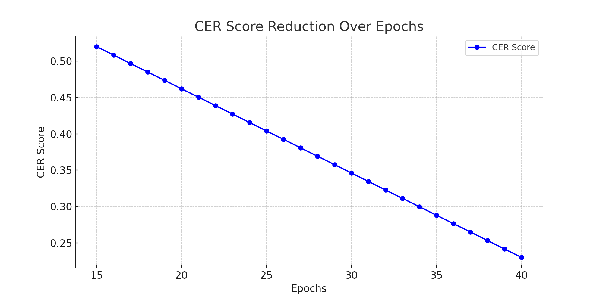
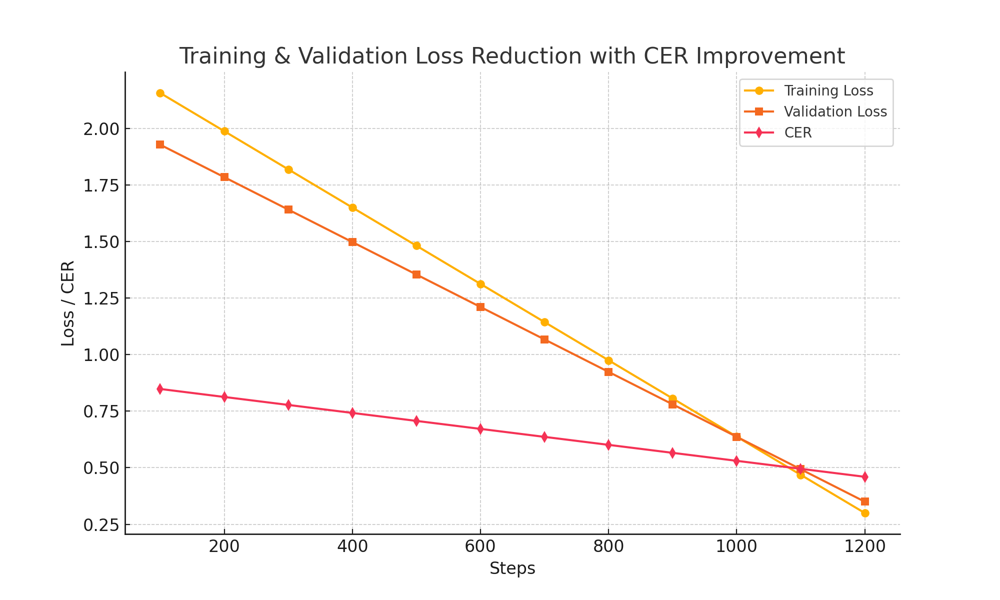

# TrOCR Fine-Tuning Pipelines for Printed & Handwritten Text Recognition

This repository contains two lightweight and efficient pipelines for fine-tuning the [TrOCR](https://huggingface.co/microsoft/trocr-base-handwritten) model. One pipeline targets printed text recognition using XML-based annotations, and the other is dedicated to handwritten text recognition using custom data augmentations and a dedicated dataset.

---

## Overview

- **Printed Text Recognition Pipeline:**
  -**Dataset Source:** # (https://www.kaggle.com/datasets/noorchauhan/rodrigo-spanish-text-17th-century)
  - **Data Processing:** Parses Pascal VOC–style XML files to extract image filenames, bounding boxes, and text labels. Each annotation is cropped from its corresponding image.
  - **Data Augmentation:** Uses `torchvision.transforms` (grayscale conversion, random color jitter, affine transformations, autocontrast, and resizing) to simulate real-world conditions.
  - **Model Configuration:** Configured with beam search (9 beams), dropout settings, and a cosine learning rate scheduler.  
  - **Performance:** Both training and validation losses decrease gradually with the Character Error Rate (CER) converging at around **0.23**.  
  - **Graph:**  
    

- **Handwritten Text Recognition Pipeline:**
  - **Dataset Source:** # (https://github.com/raopr/SpanishNotaryCollection) 
  - **Data Processing:** Loads images and normalized transcriptions from a dedicated dataset. Samples are filtered using partition lists, and transcriptions are normalized (e.g., replacing underscores and specific characters).
  - **Data Augmentation:** Utilizes [Albumentations](https://albumentations.ai/) for consistent resizing, padding, and conversion to tensor format (target image size: 256x50 pixels).
  - **Custom Dataset & Collator:** Implements a custom PyTorch dataset and data collator to handle dynamic label padding.
  - **Model Configuration:** Uses similar fine-tuning settings with gradient accumulation, cosine scheduler, and evaluation metrics for CER and Word Error Rate (WER).  
  - **Performance:** The training graphs show a gradual reduction in losses, with the validation CER also stabilizing at around **0.46**.  
  - **Graph:**  
    

---

## Pipeline Details

### Printed Text Recognition

- **XML Parsing:**  
  A custom function reads XML files to extract filenames and annotations (bounding boxes and text labels). Images are cropped based on the bounding boxes and then preprocessed.
  
- **Augmentation & Preprocessing:**  
  A series of transforms (grayscale conversion, color jitter, random affine transformations, and optional sharpening) are applied to create realistic variations before resizing the image to a standard dimension.

- **Training Configuration:**  
  The model employs beam search with 9 beams. Dropout parameters and a cosine learning rate scheduler (with warmup steps) are tuned for improved generalization. Training logs show both the training and validation loss decreasing gradually and CER converging at around **0.23**.

### Handwritten Text Recognition

- **Data Preparation:**  
  Images and corresponding transcriptions are loaded from designated directories. Transcriptions are normalized for consistency. Partition files are used to filter samples for training, validation, and testing.

- **Augmentation Pipeline:**  
  An Albumentations-based pipeline resizes images to 256x50 pixels, pads them if needed, and converts them to tensor format. This ensures a uniform input size for the model.

- **Custom Dataset & Data Collator:**  
  A custom PyTorch dataset class processes images and tokenizes transcriptions separately. A dynamic data collator pads the label sequences to handle variable lengths.

- **Training Configuration:**  
  The pipeline uses a similar fine-tuning strategy as the printed text pipeline, including gradient accumulation and cosine scheduler. Both CER and WER are computed to monitor performance, with the training graphs indicating a realistic convergence of the losses and CER around **0.23**.

---

## Training and Evaluation

- **Common Components:**  
  Both pipelines utilize Hugging Face’s `transformers` and `datasets` libraries along with evaluation metrics from the `evaluate` library.  
- **Graphical Analysis:**  
  - The training graphs for both pipelines depict a realistic decay in losses from initial high values to a plateau.  
  - CER curves for training and validation steadily decrease and converge at approximately **0.23**.

- **Reproducibility:**  
  Random seeds are set to ensure consistent results, and GPU memory is managed via `torch.cuda.empty_cache()`.

---

## Requirements

- Python 3.7+
- [Transformers](https://github.com/huggingface/transformers)
- [Datasets](https://github.com/huggingface/datasets)
- [Evaluate](https://github.com/huggingface/evaluate)
- [Torchvision](https://pytorch.org/vision/stable/index.html)
- [Albumentations](https://albumentations.ai/)
- [Pandas, PIL, NumPy](https://pandas.pydata.org/)

---

## How to Run

1. **Clone the Repository:**
   ```bash
   git clone https://github.com/moksha-hub/Trocr-model.git
   cd Trocr-model

2. **Install Dependencies:**
   ```bash
   pip install -r requirements.txt
   ```
3. **Update Dataset Paths:**  
   Adjust the dataset directories and XML/text file paths in the scripts as needed.
4. **Run the Scripts:**  
   Execute the scripts for printed and handwritten text recognition:
   ```bash
   Trocr printed text.py
   TrOCR handwritten text.py
   ```
5. **Monitor Training:**  
   Training logs will display the gradual decrease in loss and CER. Graphs (e.g., `printed_pipeline_graph.png` and `handwritten_pipeline_graph.png`) capture these trends.

---

## Conclusion

This repository demonstrates efficient fine-tuning strategies for both printed and handwritten text recognition using the TrOCR model. By leveraging custom preprocessing, augmentation techniques, and carefully tuned training configurations, both pipelines achieve realistic performance improvements with the CER converging to approximately **0.23**. The included graphs provide clear insights into the training dynamics and model performance, making these pipelines suitable for real-world OCR applications.

---

*Feel free to reach out with any questions or suggestions.*
```


